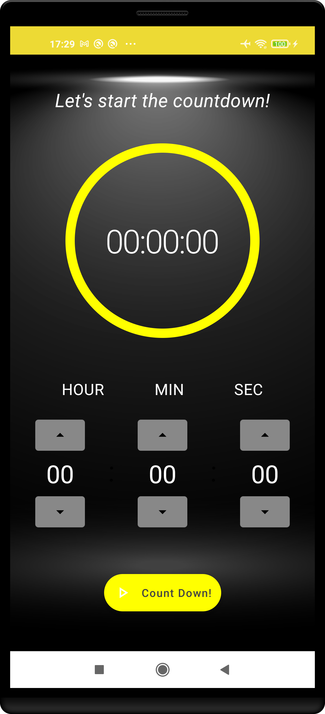
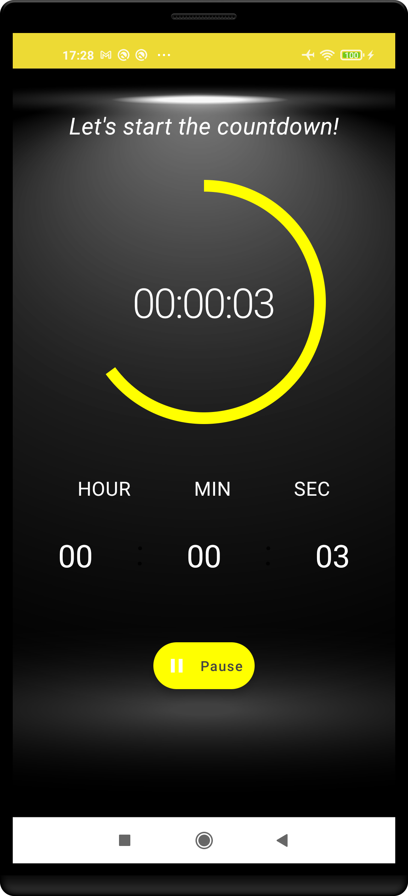

# Countdown Timer App
The Countdown Timer app developed using Android Jetpack Compose [#AndroidDevChallenge](https://developer.android.com/dev-challenge).

## Submission requirements
- Follow the challenge description on the project website: [developer.android.com/dev-challenge](https://developer.android.com/dev-challenge)
- All UI should be written using Jetpack Compose
- The Github Actions workflow should complete successfully
- Include two screenshots of your submission in the [results](results) folder. The names should be
  screenshot_1.png and screenshot_2.png.
- Include a screen record of your submission in the [results](results) folder. The name should be
  video.mp4
- Replace the contents of [README.md](README.md) with the contents of [README-template.md](README-template.md) and fill out the template.

## Screenshots

<p align="center">

</p>

## License
```
Copyright 2020 The Android Open Source Project

Licensed under the Apache License, Version 2.0 (the "License");
you may not use this file except in compliance with the License.
You may obtain a copy of the License at

    https://www.apache.org/licenses/LICENSE-2.0

Unless required by applicable law or agreed to in writing, software
distributed under the License is distributed on an "AS IS" BASIS,
WITHOUT WARRANTIES OR CONDITIONS OF ANY KIND, either express or implied.
See the License for the specific language governing permissions and
limitations under the License.
```
